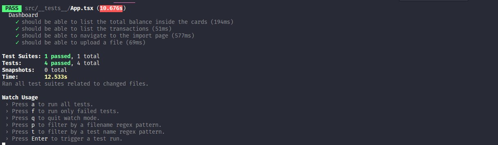

<h1 align="center">Desafio 07: GoFinances Web -  GoStack Turma 11</h1>

### Sobre o desafio

- Desafio 06 do bootcamp da Rocketseat onde continue desenvolvendo a aplicação de gestão de transações, a GoFinances. Agora você irá praticar o que você aprendeu até agora no React.js junto com TypeScript, utilizando rotas e envio de arquivos por formulário.

### Objetivo
- Criar uma  aplicação que deve armazenar transações financeiras de entrada e saída e permitir o cadastro e a listagem dessas transações, além de permitir a criação de novos registros no banco de dados a partir do envio de um arquivo csv.

### Testes
- Após a implementação os testes devem ser executados para que possa ser avaliado todos os pontos do desafio proposto.

Para esse desafio, temos os seguintes testes:

- **`should be able to list the total balance inside the cards`**: Para que esse teste passe, sua aplicação deve permitir que seja exibido na sua Dashboard, cards contendo o total de `income`, `outcome` e o total da subtração de `income - outcome` que são retornados pelo balance do seu backend.

* **`should be able to list the transactions`**: Para que esse teste passe, sua aplicação deve permitir que sejam listados dentro de uma tabela, toda as transações que são retornadas do seu backend.

- **`should be able to navigate to the import page`**: Para que esse teste passe, você deve permitir a troca de página através do Header, pelo botão que contém o nome `Importar`.

- **`should be able to upload a file`**: Para que esse teste passe, você deve permitir que um arquivo seja enviado através do componente de drag-n-drop na página de `import`, e que seja possível exibir o nome do arquivo enviado para o input.

### Resultado dos testes:

**Rocketseat!! GoStack11!! Desafio07 ReactJS!!**
